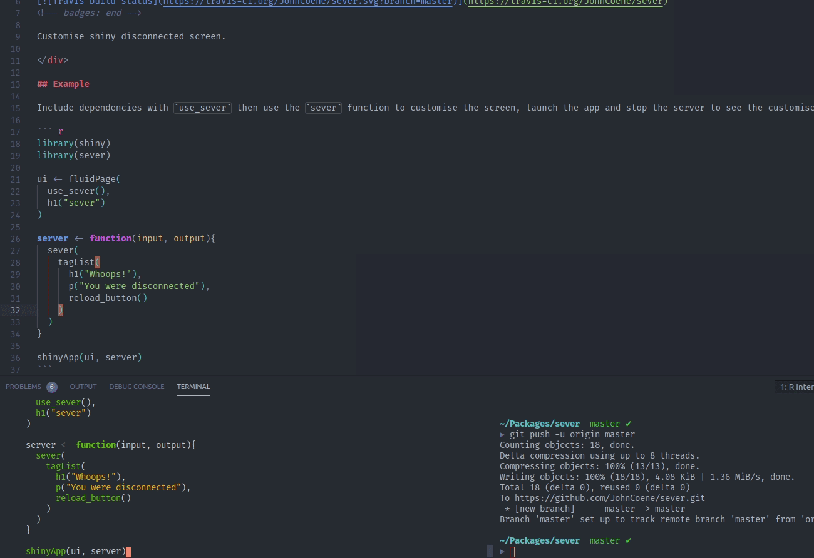

<div align="center">

# sever

<!-- badges: start -->
[](https://travis-ci.org/JohnCoene/sever)
<!-- badges: end -->

Customise shiny disconnected screen.

</div>

## Example

Include dependencies with `use_sever` then use the `sever` function to customise the screen, launch the app and stop the server to see the customised screen.

``` r
library(shiny)
library(sever)

ui <- fluidPage(
  use_sever(),
  h1("sever")
)

server <- function(input, output){
  sever(
    tagList(
      h1("Whoops!"),
      p("You were disconnected"),
      reload_button()
    )
  )
}

shinyApp(ui, server)
```



## Installation

``` r
# install.packages("remotes")
remotes::install_github("JohnCoene/sever")
```
