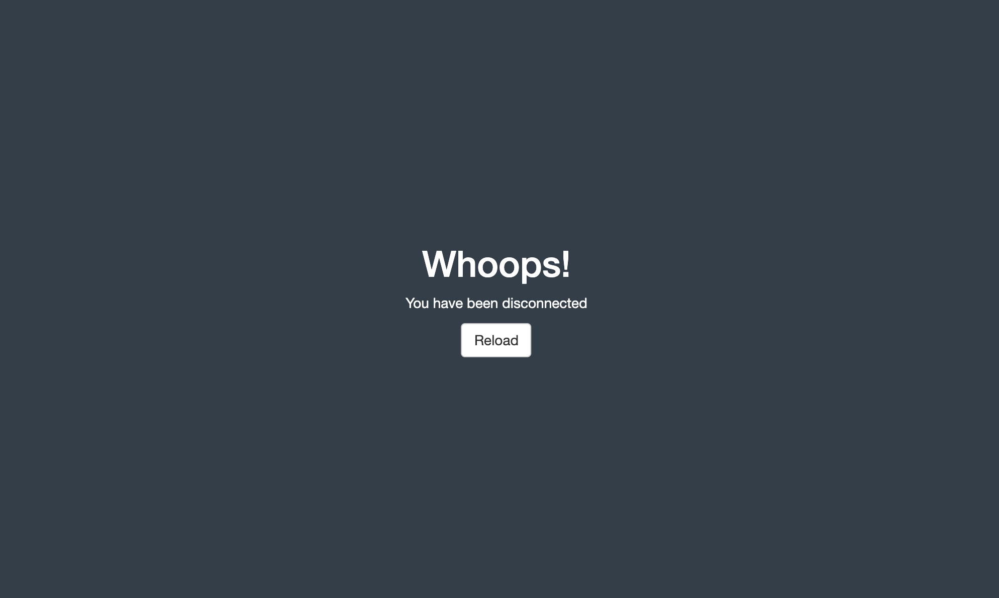

<div align="center">

# sever

<!-- badges: start -->
[](https://travis-ci.org/JohnCoene/sever)
[](https://ci.appveyor.com/project/JohnCoene/sever)
[](https://circleci.com/gh/JohnCoene/sever)
<!-- badges: end -->

Customise shiny disconnected screen.

</div>

## Usage

Include dependencies with `use_sever` then use the `sever` function to customise the screen, launch the app and stop the server to see the customised screen.

``` r
library(shiny)
library(sever)

ui <- fluidPage(
  use_sever(),
  h1("sever")
)

server <- function(input, output){
  sever()
}

shinyApp(ui, server)
```



The first argument `sever` (`html`) is used to specify the html to be displayed on the disconnected screen and defaults to `sever_default`; you can of course change that behaviour.

``` r
library(shiny)
library(sever)

disconnected <- tagList(
  h1("Whoah there..."),
  p("Something went terrible wrong!"),
  reload_button("REFRESH", class = "warning")
)

ui <- fluidPage(
  use_sever(),
  h1("sever")
)

server <- function(input, output){
  sever(html = disconnected, bg_color = "#000")
}

shinyApp(ui, server)
```

If you want to even further customise the screen with CSS; it is assigned the `severed` CSS class.

## Get it

Install it from Github with:

``` r
# install.packages("remotes")
remotes::install_github("JohnCoene/sever")
```
