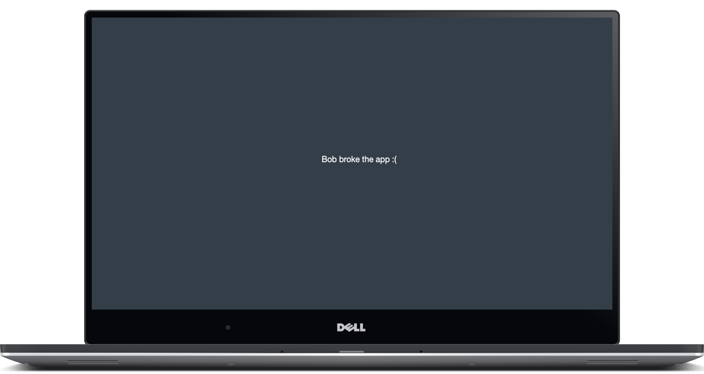

# Examples

## Combine

You can of course combine sever and cleave.

```r
library(shiny)
library(sever)

ui <- fluidPage(
  useSever(),
  uiOutput("error")
)

server <- function(input, output){
  sever()
  cleave("Gah!")

  output$error <- renderPrint(error)
}

shinyApp(ui, server)
```

## Server Defined Variables

You can use variables defined server-side to deliver for informative messages.

```r
library(shiny)
library(sever)

ui <- fluidPage(
  useSever(),
  textInput("name", "Your name")
)

server <- function(input, output){
  
  observeEvent(input$name, {
    msg <- p(input$name, "broke the app :(")
    sever(msg)
  })
}

shinyApp(ui, server)
```



## Frameworks

If you are using another CSS/JavaScript framework, the sever button may not display correctly. You only need the button to trigger `location.reload();`

```html
<a onClick = 'location.reload();'></a>
```

Or in R.

```r
tags$a(onClick = "location.reload();")
```
